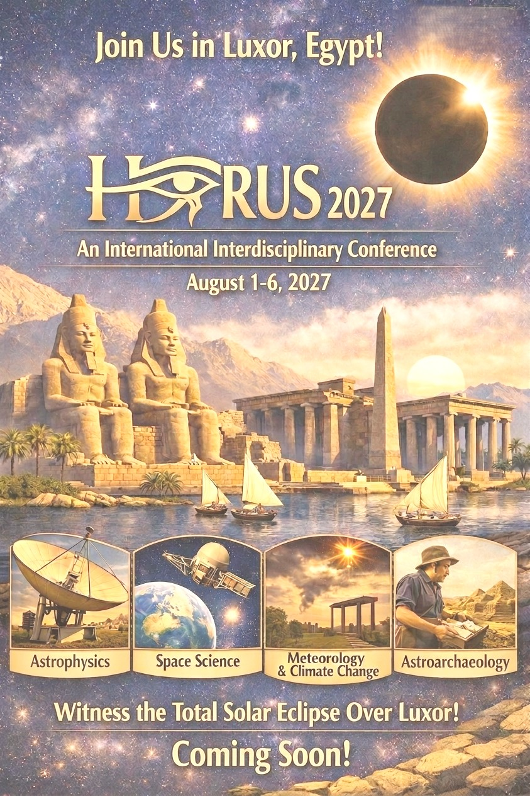
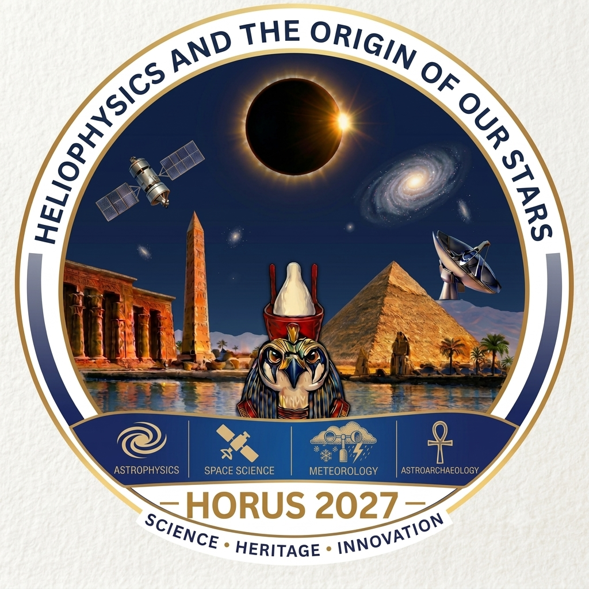

# HORUS 2027: Heliophysics and the ORigins of oUr Stars

Astronomy and Space Science beneath the Solar Eclipse

<a href="#Conference-Invitation-Poster-(HORUS2027-Invitation-Poster.jpeg)" class="subtitle2 poster-trigger">August 1 - 6, 2027 / Luxor, Egypt</a>

<a href="#Conference-Invitation-Poster-(HORUS2027-Invitation-Poster).jpeg">Click here to view the invitation for HORUS 2027</a>

<a href="#" class="poster-modal-close" aria-label="閉じる">&times;</a>

<a href="images/HORUS2027-Invitation-Poster.jpeg" download="Conference Invitation Poster (HORUS2027-Invitation-Poster).jpeg" class="poster-download">⬇ Download Poster</a>

<h2 style="color: black; text-align: left; margin: 30px 0;">Rationale</h2>

With its 6 minutes and 22 seconds of totality, the total solar eclipse of August 2, 2027, is one of the most exceptional astronomical events of the decade. Owing to its location along the path of totality, Luxor in Egypt will offer one of the world's most favorable sites for eclipse observations. Beyond its scientific importance for solar research, this event provides a unique opportunity to unite international researchers from diverse scientific disciplines, fostering an environment for interdisciplinary collaboration.

We propose to use the 2027 total solar eclipse as a unique scientific catalyst for an interdisciplinary conference on astronomy and space science. The conference will bring together expert researchers in the fields of star formation, stellar evolution, solar physics, space science, and climate change. Plenary sessions will promote cross-disciplinary interactions and stimulate new collaborations, while parallel sessions will provide opportunities for specialized workshops and focused scientific discussions.

<h2 style="color: black; text-align: left; margin: 30px 0;">Format</h2>

An Interdisciplinary conference on astrophysics and space science with plenary sessions promoting cross-disciplinary interactions and focused parallel workshops on star formation, solar physics, and space science.

<h2 style="color: black; text-align: left; margin: 30px 0;">Scientific Organizing Committee (SOC)</h2>

<table class="soc-table">
<tr><th colspan="3">Astrophysics</th></tr>
<tr><td class="m-name">Doris Arzoumanian</td><td class="m-field">Star formation</td><td class="m-affil">Kyushu University, Japan</td></tr>
<tr><td class="m-name">Zainab Awad</td><td class="m-field">Star formation</td><td class="m-affil">Cairo University, Egypt</td></tr>
<tr><td class="m-name">Javier Ballesteros-Paredes</td><td class="m-field">Star formation</td><td class="m-affil">UNAM/IRyA, Mexico</td></tr>
<tr><td class="m-name">Alessio Traficante</td><td class="m-field">Star formation</td><td class="m-affil">INAF, Italy</td></tr>

<tr><th colspan="3">Space Science</th></tr>
<tr><td class="m-name">Fawzy Abdel-Salam</td><td class="m-field">Space Dynamics</td><td class="m-affil">Cairo University, Egypt</td></tr>
<tr><td class="m-name">Essam El-ghamry</td><td class="m-field">Space Physics</td><td class="m-affil">EJUST, Egypt</td></tr>
<tr><td class="m-name">Huixin Liu</td><td class="m-field">Space Physics</td><td class="m-affil">Kyushu University, Japan</td></tr>
<tr><td class="m-name">Ayman Mahrous</td><td class="m-field">Space Physics, Space Weather</td><td class="m-affil">EJUST, Egypt</td></tr>
<tr><td class="m-name">Walid Rahoma</td><td class="m-field">Space Dynamics</td><td class="m-affil">Cairo University, Egypt</td></tr>
<tr><td class="m-name">Al-Shaimaa Saad</td><td class="m-field">Solar Physics, Space Physics</td><td class="m-affil">Cairo University, Egypt</td></tr>

<tr><th colspan="3">Meteorology and Climate Change</th></tr>
<tr><td class="m-name">Magdy Abdel-Wahab</td><td class="m-field">Atmospheric Physics</td><td class="m-affil">Cairo University, Egypt</td></tr>
<tr><td class="m-name">Moetasem El-Taweel</td><td class="m-field">Atmospheric Modeling</td><td class="m-affil">Cairo University, Egypt</td></tr>
<tr><td class="m-name">Maha Harhash</td><td class="m-field">Atmospheric Physics</td><td class="m-affil">Cairo University, Egypt</td></tr>

<tr><th colspan="3">Astroarchaeology</th></tr>
<tr><td class="m-name">Tarek Tawfeek</td><td class="m-field">Egyptology</td><td class="m-affil">Cairo University, Egypt</td></tr>
<tr><td class="m-name">Naser Mekawy</td><td class="m-field">Egyptology</td><td class="m-affil">Cairo University, Egypt</td></tr>
</table>

<h2 style="color: black; text-align: left; margin: 30px 0;">Local Organizing Committee (LOC)</h2>
<ul class="member-list">
<li>Fawzy Abdel-SalamCairo University, Egypt</li>
<li>Zainab AwadCairo University, Egypt</li>
<li>Heidi BayoumyCairo University, Egypt</li>
<li>Walid RahomaCairo University, Egypt</li>
<li>Tarek TawfeekCairo University, Egypt</li>
</ul>

<h2 style="color: black; text-align: left; margin: 30px 0;">Solar Eclipse Observation Coordinators</h2>
<ul class="member-list">
<li>Morsi AmerCairo University, Egypt</li>
<li>Hussain FariedCairo University, Egypt</li>
</ul>

<h2 style="color: black; text-align: left; margin: 30px 0;">Latest Information</h2>

<ul>
<li>2026/09/19Launching the HORUS 2027 website </li>
</ul>

